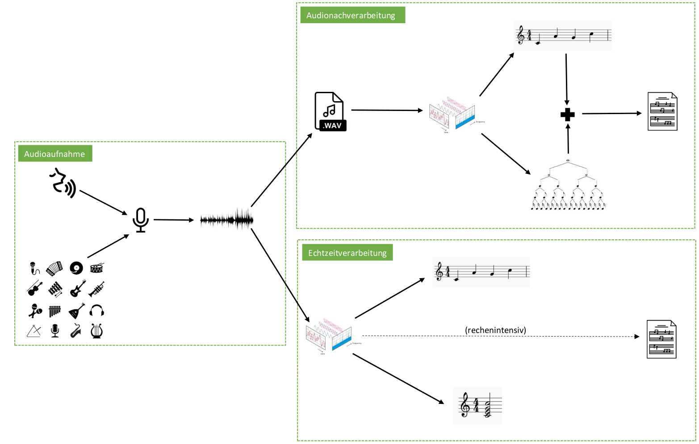
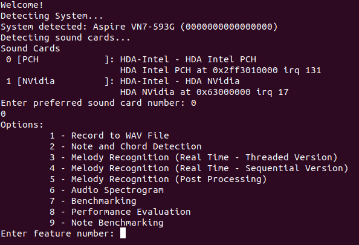
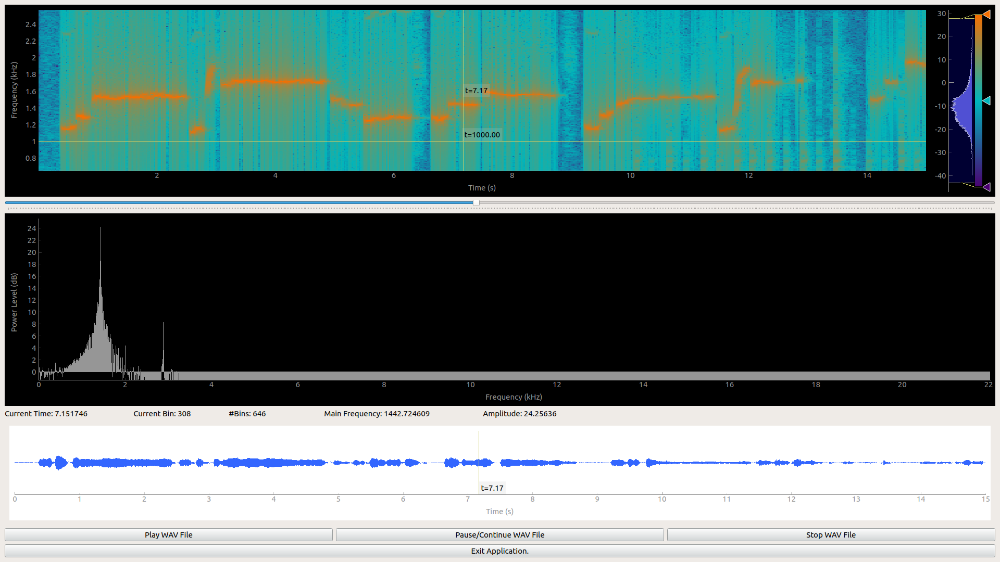
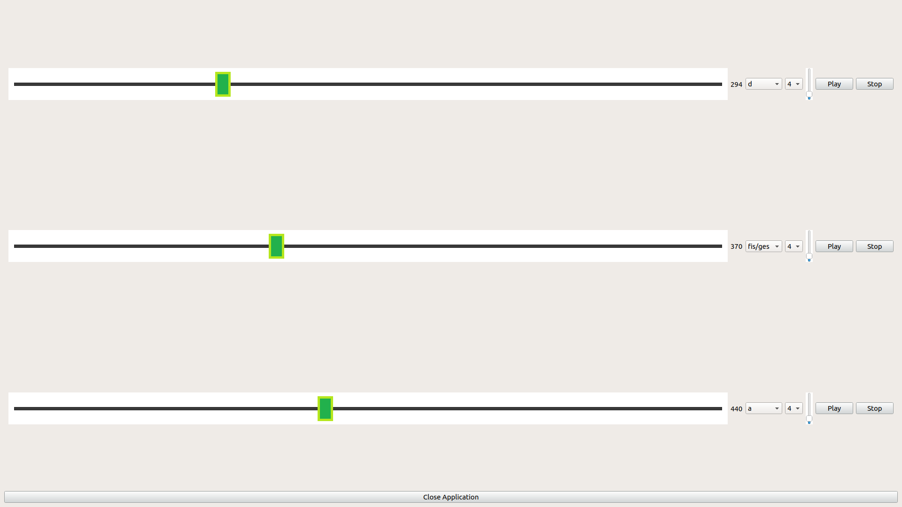
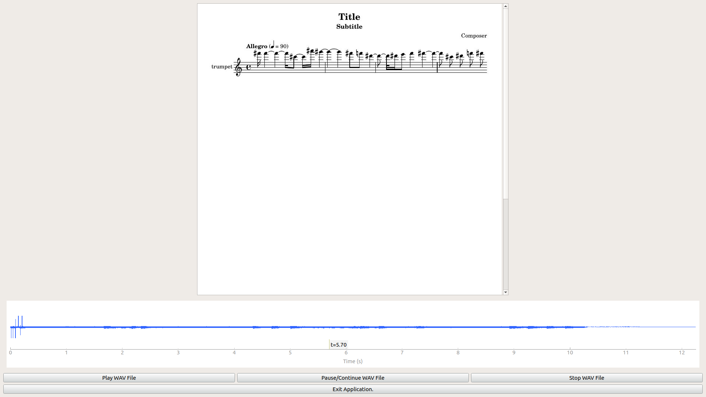
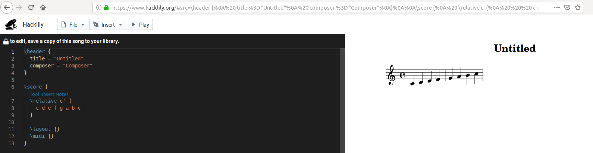

# Music Transcription Software
## Pipeline


<p>The pipeline will capture raw audio input and transcribes it into a musical notation. Over the course of the pipeline the audio data will be preprocessed 
before being transformed into the frequency domain by an FFT. The FFT data will then be analyzed by custom functions to translate the processed audio data 
into notation that can be understood by Lilypond to create a notesheet and midi file out of the recognised melody.</p>

## Getting Started
The source code of the project can be found here: https://atreus.informatik.uni-tuebingen.de/graber/bachelor_thesis

### Prerequisites

The execution of the system needs some prerequisites to work properly:  
- Linux system (only tested on Ubuntu and Raspberry Pi Ubuntu version)
- Lilypond: http://lilypond.org/doc/v2.19/Documentation/topdocs/INSTALL.html

### Installing

To enable note sheet generation, LilyPond needs to be installed. This can not be done for arm systems like the raspberry pi:  
```
sudo apt-get install lilypond
```  
There are some graphical user interfaces in the system. To enable graphical user interfaces for the project, there need to be some python packages installed first.
You can use the install bash script in the highest folder level of the project. The script needs to be executable.
```
sudo chmod 755 ./installScript  
./installScript
``` 
### Compile

Go into src folder:
```
:~$ cd .../core/src
```
In the directory, there is a make file that will compile the necessary code:
```
:~/.../core/src$ make
```
You can now execute the program executable:
```
:~/.../core/src$ ./main
```
The pipeline should now be running and you can interact with program over command line.

### Example

<p>When starting the program, the executing system will be detected and the user has the option to choose between different sound cards of the system. Afterwards multiple options are presented. The user can choose one mode of the system.</p>


### Output

<p>Depending on execution mode that was selected, the system provides different results. For the audio spectrogram, the system will save the processed data in a csv file that can be visualised by the Audio Spectogram python tool.</p>

<p>For the chord detection, the system provides a graphical user interface to play and alter different frequencies.</p>

<p>For the three pipeline variants, LilyPond will create a pdf as notesheet and a midi file of the recognized melody. The program will visualize the results in a graphical user interface, if the executing system has lilypond installed.</p>

<p>For arm systems, there is the option to enter the melody as an url to generate a notesheet online through [HackLily](https://www.hacklily.org/).</p>


### Documentation
[Doxygen](http://www.doxygen.nl/) can be used to create a documentation of the code. The generated files can be accessed through the browser.
```
doxygen dconfig
```

## Authors

**Lukas Graber**

